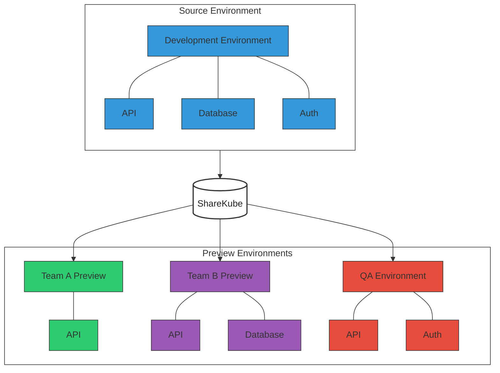
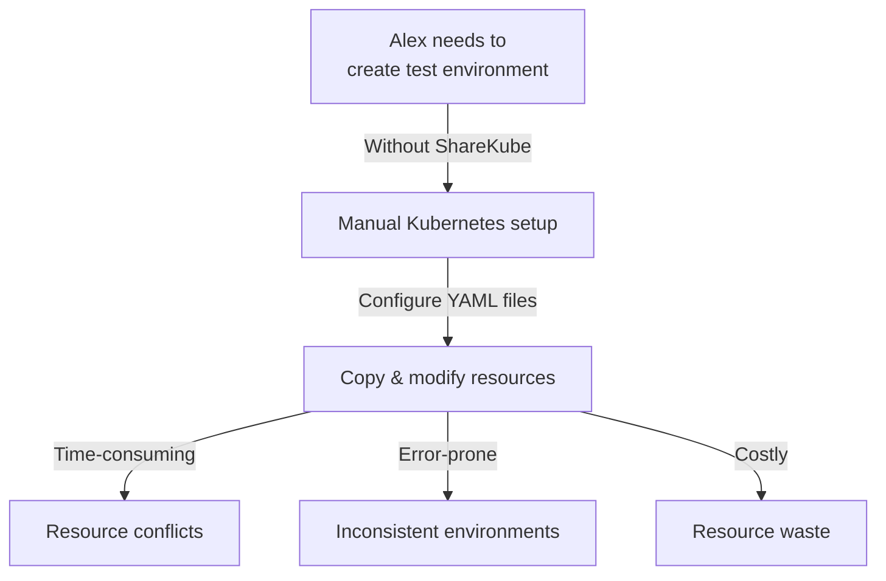
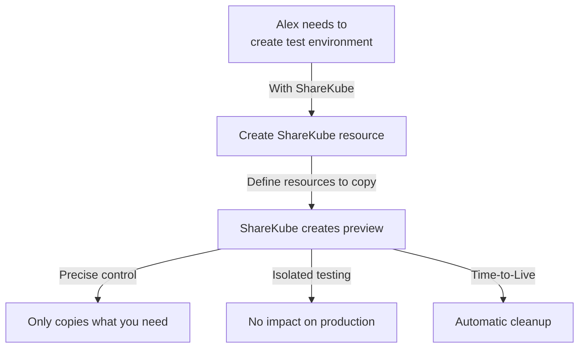
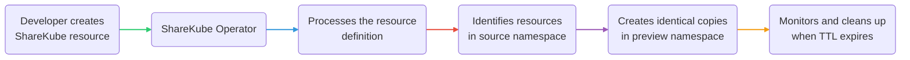

# ShareKube

**ShareKube** is a Kubernetes extension that allows users to create temporary preview environments by copying explicitly defined resources from one namespace to another within the same cluster. This powerful tool is designed for developers and QA teams who need to quickly replicate parts of their environment for testing, demonstration, or validation purposes.

## The Problem ShareKube Solves

**In simple terms:** ShareKube lets you copy parts of your Kubernetes applications to create temporary testing environments. Instead of rebuilding everything from scratch, you can select exactly which pieces you need and ShareKube will create perfect copies that clean themselves up when you're done.



### Meet Alex, Platform Lead at FinTech Inc.

Alex leads a team of 12 developers working on a complex microservices-based payment processing platform running on Kubernetes. The platform consists of 30+ services across multiple namespaces:

- `payments-prod`: Contains core payment processing services
- `analytics-prod`: Contains data processing and reporting services
- `auth-prod`: Contains authentication and authorization services

**Alex's Challenge:** The QA team needs an isolated copy of the payment processing services to test a major new feature before it goes to production. They need real services but don't want to replicate the entire cluster.

---

### 🔴 The Challenge: Manual Environment Setup

**Without ShareKube:**



Alex would need to:
1. Manually identify all relevant services, deployments, and configs
2. Copy and modify YAML files for each resource
3. Ensure all dependencies are correctly configured
4. Set up network policies and service discovery
5. Manually clean up afterwards

This process would take Alex's team 3-4 days and frequently results in missed dependencies or configuration errors.

---

### 🟢 The Solution: ShareKube Automation

**With ShareKube:**



Alex creates a single ShareKube resource:
```yaml
apiVersion: sharekube.dev/v1alpha1
kind: ShareKube
metadata:
  name: payment-feature-test
  namespace: payments-prod
spec:
  targetNamespace: preview
  ttl: 48h
  resources:
    - kind: Deployment
      name: payment-processor
    - kind: Deployment
      name: transaction-api
    - kind: ConfigMap
      name: payment-config
```

**The Result:** In less than 5 minutes, ShareKube creates an isolated test environment with exactly the components the QA team needs. The environment automatically cleans itself up after 48 hours, and Alex's team saves over 25 hours of DevOps work.

---

## What ShareKube Does

With ShareKube, you can:

- **Create isolated preview environments** by copying selected Kubernetes resources
- **Set time limits** for automatic cleanup of these environments
- **Explicitly define** which resources should be included in your preview
- **Maintain isolation** between your source environment and previews

## How It Works

### 🔄 ShareKube Workflow
The ShareKube workflow is straightforward: create a CRD, specify what to copy, and let the operator handle the rest. When the environment is no longer needed, automatic cleanup occurs based on your TTL settings.



ShareKube works in five simple steps:

1. **You create a ShareKube resource** that defines what you want to preview
2. **You specify which resources to copy** and how long they should exist
3. **ShareKube locates the resources** in your source namespace
4. **ShareKube creates exact copies** in your preview namespace 
5. **ShareKube automatically cleans up** when the time-to-live expires

With this workflow, you can:
- Create isolated preview environments in seconds
- Test changes safely without affecting production
- Share temporary environments with your team
- Focus on your work while ShareKube handles the infrastructure

## Key Benefits

- **Automation**: Remove manual steps in creating preview environments
- **Isolation**: Test changes without affecting the source environment
- **Efficiency**: Rapidly create and clean up temporary environments
- **Explicit Control**: Only copy the resources you specify

## Future Enhancements

While the current MVP focuses on resource copying, our roadmap includes:

- **Dynamic transformation rules** for automatically modifying copied resources
- **Remote cluster support** for copying resources across clusters
- **Network exposure solutions** for easier access to preview environments

Ready to get started? Check out our [Getting Started guide](getting-started) or dive into the [Architecture Overview](overview). 